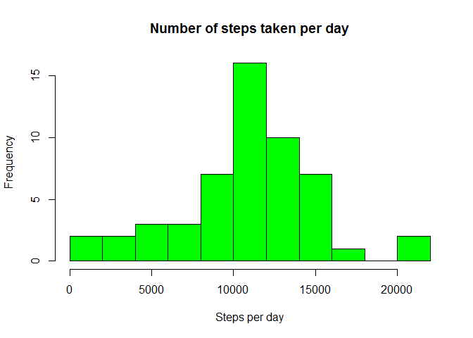
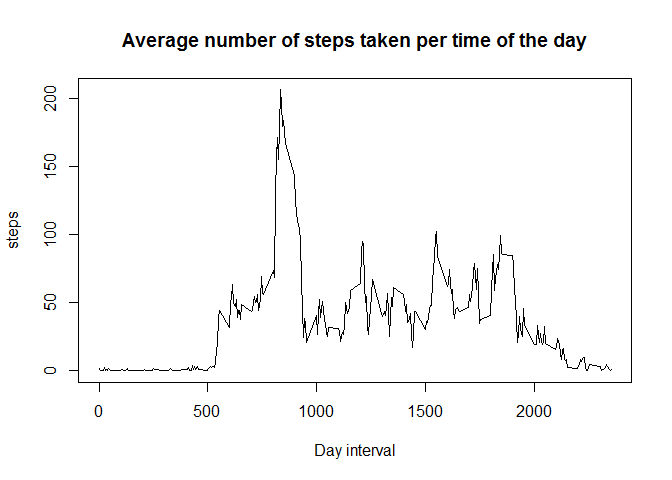
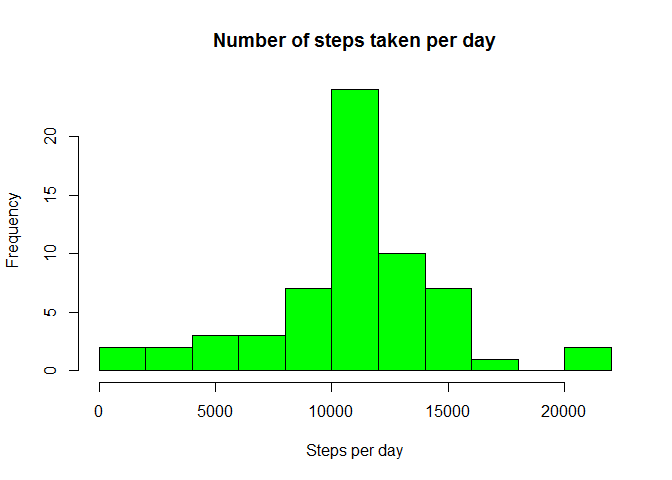
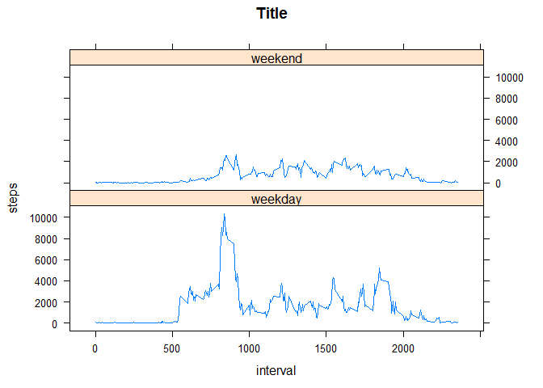

# Reproducible Research: Peer Assessment 1


## Loading and preprocessing the data

```r
# load file as RDS and extract if not extracted yet
rds_src_file <- "Data\\Src\\activity.rds"
if (file.exists(rds_src_file)) {
	# load rds file
	data <- readRDS(rds_src_file)
} else {
	print("loading from archive")
	# extract archive
	temp_file_path <- unzip("activity.zip")
	
	data <- read.csv(temp_file_path)
	file.remove(temp_file_path)
	
	# save as RDS for fast reading in future
	saveRDS(data, rds_src_file)
}

# convert date date feature to date type
data$date <- as.Date(data$date, "%Y-%m-%d")
```


## What is mean total number of steps taken per day?


```r
# aggregate steps by days
total_steps_per_day = aggregate(steps~date, data=data, sum)
# plot histogram with 15 cells 
hist(total_steps_per_day$steps, breaks=15, main="Number of steps taken per day",
		 xlab="Steps per day", col="green")
```

 

```r
# the mean and median of the total number of steps taken per day
print(paste("mean ", mean(total_steps_per_day$steps)))
```

```
## [1] "mean  10766.1886792453"
```

```r
print(paste("median ", median(total_steps_per_day$steps)))
```

```
## [1] "median  10765"
```

## What is the average daily activity pattern?


```r
# calculate average steps taken per interval
avg_steps_per_interval = aggregate(steps~interval, data=data, mean)
# plot line chart
with(avg_steps_per_interval, plot(interval, steps,
																	main = "Average number of steps taken per time of the day",
																	xlab = "Day interval",
																	type = "l"))
```

 

```r
# find interval with max amount of steps on average
max_steps = max(avg_steps_per_interval$steps)
print(avg_steps_per_interval[avg_steps_per_interval$steps == max_steps,1])
```

```
## [1] 835
```


## Imputing missing values


```r
# so we have average steps taken per interval (avg_steps_per_interval$steps)
# let's repeat it by number of days to get one long verctor of mean per each
# we get long vector with average number of steps per interval for each row of source data
long_average_per_interval = rep(avg_steps_per_interval$steps, times=length(unique(data$date)))

data_without_NA = data[,]
# replace NA with average per this interval through all dataset
data_without_NA$steps[is.na(data$steps)] = long_average_per_interval[is.na(data$steps)]

# aggregate steps by days
total_steps_per_day = aggregate(steps~date, data=data_without_NA, sum)

# plot histogram with 15 cells
hist(total_steps_per_day$steps, breaks=15, main="Number of steps taken per day",
		 xlab="Steps per day", col="green")
```

 

```r
# the mean and median of the total number of steps taken per day
print(paste("mean ", mean(total_steps_per_day$steps)))
```

```
## [1] "mean  10766.1886792453"
```

```r
print(paste("median ", median(total_steps_per_day$steps)))
```

```
## [1] "median  10766.1886792453"
```

## Are there differences in activity patterns between weekdays and weekends?

```r
library(lattice)

# replace date with 
weekends = grepl("Sat|Sun", weekdays(data_without_NA$date))
data_without_NA$daytype[weekends] = "weekend"
data_without_NA$daytype[!weekends] = "weekday"

total_steps_per_day = aggregate(steps~interval+daytype, data=data_without_NA, sum)
total_steps_per_day$daytype = as.factor(total_steps_per_day$daytype)

xyplot(steps~interval|daytype, data=total_steps_per_day, main="Title",
			 layout=c(1,2), type = "l")
```

 
